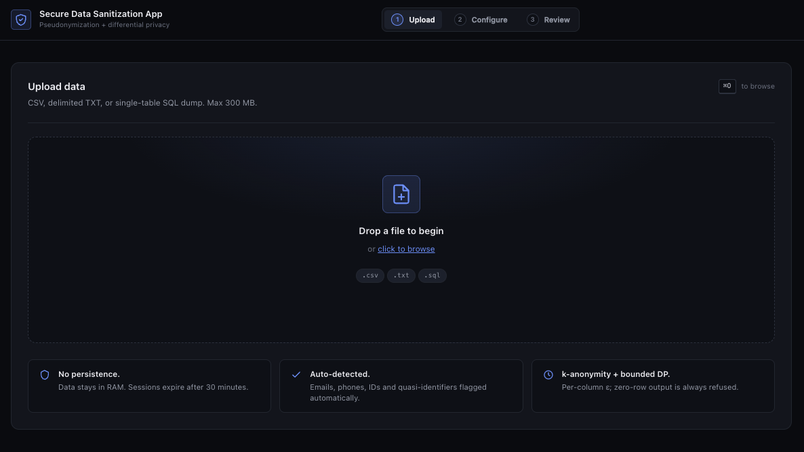

# SDSA - Secure Data Sanitization App

SDSA is a self-hostable web app for sanitizing tabular data before it leaves a
trusted environment. It ingests CSV, delimited TXT, and single-table SQL
`INSERT` dumps; detects likely sensitive fields; applies explicit per-column
privacy policies; enforces k-anonymity; and exports a sanitized CSV with a JSON
and Markdown privacy report.

[](LICENSE)
[](backend/pyproject.toml)
[](backend/tests/)
[](https://github.com/defai-digital/sdsa/actions/workflows/docker.yml)



SDSA is designed for compliance-oriented engineering, analytics, and vendor data
sharing workflows where transformations must be reviewable and reproducible. It
is not a black-box anonymization service, and it does not claim dataset-level
`(epsilon, delta)` differential privacy.

For a first run, start with [QUICKSTART.md](QUICKSTART.md).

## When To Use SDSA

Use SDSA when you need a repeatable, reviewable release process for tabular
data that still has analytic or test value after sanitization. Good fits
include vendor extracts, QA datasets, support/debugging snapshots, internal
analytics handoffs, and customer-facing evidence packages where the recipient
does not need raw identifiers.

Do not treat SDSA as a replacement for legal review, access control, encrypted
storage, or a full formal anonymization proof. The output is safer
pseudonymized microdata with explicit guardrails and a report, not a guarantee
that every auxiliary-data linkage attack is impossible.

## What SDSA Does

- Upload CSV, TXT, or SQL data through a browser UI or REST API.
- Infer schema and detect likely PII such as email, phone, card number,
  government ID, date of birth, name, address, and identifier columns
  (near-unique `*_id` keys are suggested for tokenization rather than left in
  cleartext, while low-cardinality `*_id` foreign-key codes are kept for
  analysis).
- Suggest field policies from detection results and optional project policy
  files.
- Apply masking, HMAC hashing, tokenization, redaction, dropping, numeric
  binning, date truncation, string truncation, and bounded Laplace noise.
- Enforce k-anonymity over operator-selected quasi-identifiers and measure or
  enforce l-diversity for sensitive cleartext attributes.
- Estimate suppression before processing through a preflight endpoint and UI.
- Export a sanitized CSV plus machine-readable and human-readable privacy
  reports.
- Summarize before/after utility (information loss): row and column retention,
  per-column distinct-value retention, and an overall heuristic utility score.
- Run the whole pipeline headlessly from the command line for CI/CD and data
  pipelines, without starting the server.
- Keep uploaded data in an in-memory session store with a 30-minute default TTL.

## Privacy Model

SDSA produces pseudonymized microdata with optional per-column local-DP style
Laplace noise on numeric fields. Numeric DP requires declared `lower` and
`upper` bounds so sensitivity is explicit rather than inferred silently from the
uploaded data.

k-anonymity is enforced through suppression over declared quasi-identifiers. The
default `k` is 5. SDSA refuses zero-row output, refuses outputs above the hard
suppression cap, and requires an explicit override to exceed the soft
suppression cap.

l-diversity can be measured or enforced for sensitive cleartext attributes.
With `l=1`, SDSA reports homogeneous sensitive classes as warnings. With
`l >= 2`, those classes are suppressed along with below-k classes, subject to
the same utility caps.

Numeric DP has a per-session cumulative epsilon budget. A successful release
charges each DP column against `SDSA_EPSILON_SESSION_BUDGET`, so repeated
process runs cannot average away the noise for the same uploaded session.

Every generated report includes this claim:

> Pseudonymized microdata with per-column local-DP noise where configured.
> This output is NOT dataset-level (epsilon, delta)-differentially private.
> Linkage attacks using auxiliary data may still succeed. k-anonymity bounds
> prosecutor re-identification risk to at most 1/k.

Every report also includes a before/after utility summary so you can see how
much analytic value the sanitization removed: row and column retention,
per-column distinct-value retention, and an overall heuristic utility score in
`[0, 100]`. The score is an information-loss proxy, not a formal guarantee, and
it is computed without leaking the original distribution of DP-noised columns
(DP fidelity is derived only from the declared bounds and epsilon).

See [docs/privacy-model.md](docs/privacy-model.md) for the longer explanation,
limits, and tradeoffs.

## Quick Start

Install SDSA with `pip` first:

```bash
python3 -m pip install sdsa
sdsa-server start
```

Open <http://127.0.0.1:8000/> and upload a CSV, TXT, or SQL file.

If you want the sample files or plan to develop SDSA from source:

```bash
git clone https://github.com/defai-digital/sdsa.git
cd sdsa/backend
python3 -m venv .venv
.venv/bin/pip install -e ".[dev]"
.venv/bin/sdsa-server start
```

Then upload one of the files in
[`samples/`](samples/), such as [`samples/employees.csv`](samples/employees.csv).

For browser and CLI walkthroughs, see [QUICKSTART.md](QUICKSTART.md).

## Command-Line Batch Mode

`sdsa process` runs the full pipeline on a single file without starting the
server, then writes a sanitized CSV plus JSON and Markdown privacy reports next
to each other. It is suitable for CI/CD jobs and data pipelines.

```bash
# Auto-derive a policy from PII detection + the project policy catalog:
sdsa process data.csv --out-dir ./sanitized -k 5

# Or supply an explicit process request (same JSON shape as POST /api/process):
sdsa process data.csv --policy request.json --out-dir ./sanitized
```

Outputs are named after the input stem: `data.sanitized.csv`,
`data.report.json`, and `data.report.md`. Useful options:

| Option | Purpose |
|---|---|
| `--policy`, `-p` | JSON process request (policies, `k`, `l`, `dp_params`, `sensitive_columns`). If omitted, the policy is auto-derived. |
| `--out-dir`, `-o` | Output directory. Defaults to the current directory. |
| `-k` | Override the k-anonymity target. |
| `--accept-weaker-guarantee` | Allow suppression above the soft cap (zero-row and hard-cap output are still refused). |
| `--deterministic-key` | Key name for deterministic hashing/tokenization (requires `SDSA_DEPLOYMENT_SALT`). |
| `--quiet`, `-q` | Suppress the summary printed to stderr. |

The command exits non-zero and prints the reason to stderr if parsing, the
policy, or a guardrail (e.g. suppression over the hard cap) fails — so it can
gate a pipeline. `sdsa-server process …` is an equivalent alias.

## Repository Layout

```text
backend/                    FastAPI backend package
  src/sdsa/
    api/                    upload, preview, preflight, process, download routes
    anonymize/              policy application and primitive transforms
    core/                   config, logging, in-memory session store
    detect/                 schema inference and PII detection
    dp/                     Laplace mechanism and epsilon accountant
    kanon/                  k-anonymity enforcement
    validate/               before/after utility metrics and information-loss score
    ingest.py               CSV, TXT, and SQL parsing
    pipeline.py             end-to-end processing orchestration
    batch.py                headless command-line batch sanitization
    cli.py                  `sdsa` / `sdsa-server` entry point (start, process)
    policy_config.py        default and project policy suggestion logic
    preflight.py            k-anonymity impact estimation
    report.py               JSON and Markdown privacy reports
  tests/                    pytest suite
frontend/                   vanilla HTML, CSS, and JS served by FastAPI
docs/                       privacy model and product documentation
deploy/                     nginx and deployment support files
samples/                    synthetic CSV, TXT, and SQL demo datasets
sdsa-policy.default.json    built-in field policy catalog
sdsa-policy.json.example    starter policy override file
```

## API

| Method | Path | Purpose |
|---|---|---|
| `POST` | `/api/upload` | Upload a CSV, TXT, or SQL file as multipart form data. |
| `POST` | `/api/preview/{session_id}` | Return a small before/after sample for selected policies. |
| `POST` | `/api/preflight/{session_id}` | Estimate k-anonymity suppression before processing. |
| `POST` | `/api/process/{session_id}` | Apply policies, DP, k-anonymity, validation, and reporting. |
| `GET` | `/api/download/{session_id}/data.csv` | Download the sanitized CSV. |
| `GET` | `/api/download/{session_id}/report.json` | Download the machine-readable privacy report. |
| `GET` | `/api/download/{session_id}/report.md` | Download the Markdown privacy report. |
| `DELETE` | `/api/session/{session_id}` | Zeroize and delete the in-memory session. |
| `GET` | `/health` | Health check. |

Processing requests use this shape:

```json
{
  "policies": [
    {"column": "email", "action": "hash"},
    {
      "column": "zip",
      "action": "string_truncate",
      "params": {"keep": 3},
      "is_quasi_identifier": true
    },
    {"column": "salary", "action": "dp_laplace"}
  ],
  "k": 5,
  "l": 1,
  "sensitive_columns": [],
  "dp_params": {
    "salary": {"epsilon": 1.0, "lower": 40000, "upper": 180000}
  },
  "accept_weaker_guarantee": false
}
```

Supported actions are `retain`, `mask`, `hash`, `tokenize`, `redact`,
`numeric_bin`, `date_truncate`, `string_truncate`, `drop`, and `dp_laplace`.

Important request semantics:

- `policies` are applied in request order. A column omitted from `policies`
  remains retained by default.
- `is_quasi_identifier=true` marks the transformed column for k-anonymity.
- `sensitive_columns` lists cleartext non-QI attributes to measure or enforce
  l-diversity against. If it is empty, SDSA automatically measures cleartext
  non-QI columns.
- `l=1` only measures attribute-disclosure risk. Set `l >= 2` to enforce
  distinct l-diversity through additional suppression.
- `dp_params` is required for every `dp_laplace` column and must include
  `epsilon`, `lower`, and `upper`.
- `accept_weaker_guarantee=true` only bypasses the soft suppression cap. Zero
  rows and hard-cap breaches are always refused.

## Field Policy Files

Place `sdsa-policy.json` at the repository root to override default policy
suggestions for known fields. The backend merges suggestions in this order:

1. Exact field overrides in `sdsa-policy.json`.
2. Built-in defaults by detected PII kind or column kind.
3. Heuristic quasi-identifier fallback when no explicit rule exists.

Example:

```json
{
  "fields": {
    "dob": {
      "action": "date_truncate",
      "params": {"granularity": "year"},
      "is_quasi_identifier": true
    },
    "salary": {
      "action": "dp_laplace",
      "dp_params": {"epsilon": 0.8, "lower": 40000, "upper": 180000}
    }
  }
}
```

Use [`sdsa-policy.json.example`](sdsa-policy.json.example) as a starting point.

## Configuration

| Variable | Default | Purpose |
|---|---:|---|
| `SDSA_MAX_UPLOAD_BYTES` | `314572800` | Maximum upload size, 300 MB by default. |
| `SDSA_SESSION_TTL` | `1800` | Session lifetime in seconds. |
| `SDSA_SAMPLE_ROWS` | `10000` | Rows sampled for PII detection. Schema always uses the full dataset. |
| `SDSA_DEFAULT_K` | `5` | Default k-anonymity target. |
| `SDSA_DEFAULT_EPSILON` | `1.0` | Default epsilon used in policy suggestions. |
| `SDSA_EPSILON_MIN` | `0.1` | Minimum allowed epsilon. |
| `SDSA_EPSILON_MAX` | `10.0` | Maximum allowed epsilon. |
| `SDSA_EPSILON_SESSION_BUDGET` | `SDSA_EPSILON_MAX` | Per-column cumulative epsilon budget for one uploaded session. |
| `SDSA_MAX_SUPPRESSION` | `0.10` | Soft row-suppression cap. |
| `SDSA_HARD_MAX_SUPPRESSION` | `0.50` | Hard row-suppression cap. |
| `SDSA_ALLOWED_CORS_ORIGINS` | empty | Comma-separated allowed browser origins. `*` is rejected. |
| `SDSA_DEPLOYMENT_SALT` | random per process | Hex salt for deterministic cross-session hashing/tokenization. Keep secret. |

Deterministic mode requires `SDSA_DEPLOYMENT_SALT`. SDSA rejects deterministic
mode when the same request also contains `dp_laplace` columns.

For deterministic hashing/tokenization across sessions, set
`SDSA_DEPLOYMENT_SALT` to a stable 32-byte hex value and pass
`deterministic_key_name` in the process request. Without that salt, hashes and
tokens are intentionally session-random.

## Workflow Guidance

1. Upload and inspect the detected schema and PII suggestions.
2. Drop or redact direct identifiers that downstream users do not need.
3. Generalize likely quasi-identifiers before marking them as QIs.
4. Use preflight to check suppression before processing.
5. For numeric sensitive values that must remain numeric, use `dp_laplace`
   with explicit bounds and a conservative epsilon.
6. If a cleartext attribute is sensitive inside each QI group, mark it
   sensitive and set `l >= 2`, or mask/drop/generalize it.
7. Review the Markdown or JSON privacy report before sharing the CSV.

## Testing

```bash
cd backend
.venv/bin/pytest
.venv/bin/ruff check src tests
```

The test suite covers ingestion, PII detection, anonymization primitives,
k-anonymity, DP Laplace validation, policy configuration, API routes, preflight,
reporting, and utility metrics.

## Samples

The [`samples/`](samples/) directory contains fabricated data for manual and
load testing:

- `employees.csv`, `transactions.csv`, `customers_cjk.csv`, `access_logs.txt`,
  and `users.sql` for small manual exercises.
- Larger CSV, TXT, and SQL samples for suppression and performance testing.
- `employees_huge.csv`, generated on demand, for a roughly 200 MB load test.

Regenerate sample data with:

```bash
python3 samples/generate.py
python3 samples/generate.py --all
```

## Deployment

SDSA is designed to deploy as a single FastAPI container. The same process serves
the API and frontend, and sessions are stored in memory. Run one SDSA app process
per deployment unless you replace the session store with shared infrastructure.

### Python Package

For a simple host-level install, prefer installing the published package first:

```bash
python3 -m pip install sdsa
sdsa-server start
```

From a source checkout, use `python3 -m pip install .` inside `backend/` instead.

The `sdsa-server start` command serves both the API and the packaged frontend.
Useful options:

```bash
sdsa-server start --host 0.0.0.0 --port 8000
sdsa-server start --random-port
sdsa-server start --reload
```

### Docker

Local container:

```bash
cp .env.example .env
docker build -t defai-digital/sdsa:1.2.0 .
docker run --rm --env-file .env -p 8000:8000 defai-digital/sdsa:1.2.0
```

Local Compose:

```bash
cp .env.example .env
docker compose up --build
```

Production Compose with nginx TLS termination:

```bash
cp .env.example .env
# Place TLS certs at deploy/certs/fullchain.pem and deploy/certs/privkey.pem
docker compose -f compose.prod.yml up -d --build
```

The production compose file runs the app read-only, uses tmpfs for `/tmp`, drops
Linux capabilities, and puts nginx in front for TLS, upload limits, security
headers, and basic rate limits. See [docs/deployment.md](docs/deployment.md) for
the full deployment guide.

Tagged pushes also build and publish container images to GitHub Container
Registry through [`.github/workflows/docker.yml`](.github/workflows/docker.yml).
For example, tag `v1.2.0` publishes `ghcr.io/defai-digital/sdsa:v1.2.0`.
The workflow runs pytest and Ruff before building or publishing images.

## License

SDSA is licensed under [AGPL-3.0](LICENSE). Copyright (c) 2026 DEFAI Private
Limited.
